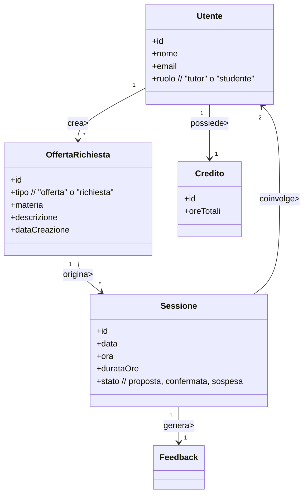
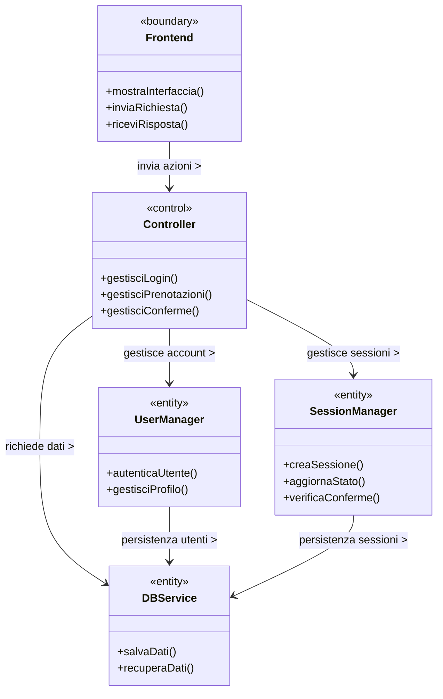
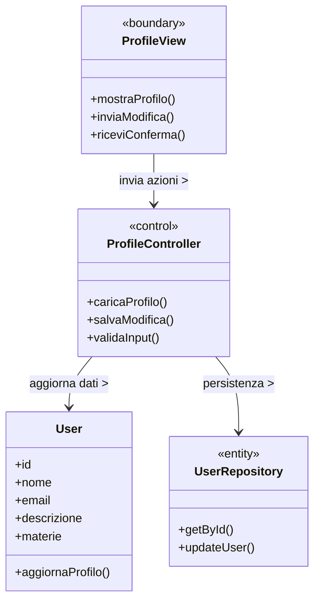

# Analisi

## Introduzione
In questa sezione vengono analizzati i requisiti e il dominio applicativo del progetto unibo_tutiring.
L'obiettivo è definire in modo chiaro cosa dovrà fare la nostra applicazione e quali elementi caratterizzano il contesto, senza entrare nei dettagli tecnici o preogettuali.

## Analisi dei requisiti
L'applicazione unibo_tutoring nasce con lo scopo di creare una piattaforma digitale per gli studenti dell'università di Bologna in cui gi utenti possono mettersi in contatto per offrire o richiedere aiuti su specifiche materie.

**Requisiti funzionali**

L'applicazione dovrà permettere le seguenti funzionaloità principali:
- Gli studenti potranno registrarsi e autenticarsi usando la matricola universitaria, garantendo così che l'accesso sia riservato agli studenti uniBo
- Gli utenti potranno creare, modificare e eliminare box di offerta/richiesta di tutoraggio, in cui specificano il corso, la materia e una breve descrizione
- Potranno consultare le offerte e le richieste pubblicate da altri utenti, anche filtrandole per materia o corso
- Gli utenti potranno quindi proporre e accettare sessioni di tutoraggio, stabilendo data, orario e durata
- Ogni sessione dovrà passare attraverso diversi stati: proposta, confermata, conclusa
- Deve essere disponibile una chat privata per la comunicazione diretta tra tutor e studente, utile a concordare i dettagli dell'incontro
- Ogni utente dovrà disporre di un profilo personale, con le informazioni base (nome, cognome, matricola) e le attività svolte

**Requisiti non funzionali**

Oltre alle funzionalità principali, l'applicazione dovrà garantire una buona esperienza d'uso e un funzionamento stabile. In particolare:
- Semplicità d'uso: interfaccia chiara e intuitiva, pensata per studenti che devono orientarsi facilmetne tra le sezioni
- Affidabilità: i dati inseriti dagli utenti devono restare coerenti e sempre disponibili
  
## Analisi e modello del dominio

Il sistema di tutoring gestisce studenti e tutor che possono proporre,
accettare o confermare sessioni di tutoraggio.  
Le entità principali del dominio sono `Utente`, `OffertaRichiesta`, `Sessione`, e `Credito`.  
Lo schema seguente rappresenta i rapporti concettuali tra queste entità.




### Elementi positivi

### Elementi negativi

#altro schema mancante 

# Design

## Architettura

### Elementi positivi

### Elementi negativi
## Design

### Visione architetturale

L’applicazione di tutoring segue un’architettura di tipo **MVC**  
(Model–View–Controller), ispirata al pattern **ECB** (Entity–Control–Boundary).  
Il frontend gestisce l’interfaccia e la comunicazione con l’utente,  
il controller coordina le operazioni principali e interagisce con i gestori di dominio,  
mentre il database garantisce la persistenza delle informazioni.



## Design dettagliato
## Design dettagliato – Niki Hammond

Di seguito vengono illustrati tre aspetti specifici del design della piattaforma di tutoring:
1. La gestione e visualizzazione del profilo utente.  
2. La logica del sistema di crediti per i tutor.  
3. L’ottimizzazione responsive dell’interfaccia utente.

---

### Gestione del profilo utente

#### Problema
Era necessario progettare una sezione che permettesse a ogni utente di modificare i propri dati (nome, email, descrizione, materie insegnate) in modo sicuro e sincronizzato con il database.  
Il sistema doveva separare chiaramente la **logica di business** (gestione dati e validazioni) dalla **presentazione grafica**, mantenendo il profilo aggiornato in tempo reale dopo ogni modifica.

#### Soluzione
È stato applicato il **pattern MVC**:  
- Il *Model* (`User`) rappresenta i dati persistenti.  
- Il *Controller* (`ProfileController`) coordina le operazioni tra view e model.  
- La *View* (`ProfileView`) mostra l’interfaccia grafica e riceve input utente.  

Questa separazione migliora il riuso e semplifica l’estensione futura, ad esempio per aggiungere nuove sezioni (badge, statistiche, ecc.).

#### UML



#### Pattern utilizzato
Applicato **MVC / ECB** per garantire separazione tra livelli e ridurre le dipendenze.  
`ProfileController` funge da *control*, `ProfileView` da *boundary*, `User` e `UserRepository` da *entity*.

---

### Sistema crediti e riconoscimenti tutor

#### Problema
Era necessario introdurre una logica che riconoscesse i tutor più attivi o affidabili, calcolando automaticamente i crediti in base alle sessioni confermate.  
Il sistema doveva reagire ai cambiamenti dello stato di una sessione senza modificare la classe `Sessione`.

#### Soluzione
È stato adottato il **pattern Observer**:  
`Sessione` notifica gli osservatori quando il suo stato passa a “confermata”.  
Il servizio `CreditService` ascolta gli eventi e aggiorna i crediti del tutor, senza introdurre dipendenze dirette.

#### UML

```mermaid
classDiagram
    %% ======================================
    %% UML DESIGN DETTAGLIATO - SISTEMA CREDITI
    %% ======================================

    class Sessione {
        +id
        +stato
        +notificaOsservatori()
        +verificaConferme()
    }

    class CreditService {
        +assegnaCrediti(Sessione)
        +aggiornaLivello()
    }

    class SessionObserver {
        +update(Sessione)
    }
    <<interface>> SessionObserver

    class Tutor {
        +id
        +crediti
        +livello
        +riceviRiconoscimento()
    }

    %% RELAZIONI
    Sessione o-- SessionObserver : notifica >
    SessionObserver <|.. CreditService : osserva >
    CreditService --> Tutor : aggiorna crediti >
 ```


#### Pattern utilizzato
**Observer Pattern**  
`Sessione` è l’observable, `CreditService` è l’observer.  
Quando una sessione viene confermata, `CreditService` riceve la notifica e incrementa i crediti del tutor associato, aggiornandone il livello (es. *Tutor Affidabile*).

---

### Ottimizzazione interfaccia responsive

#### Problema
L’interfaccia utente doveva adattarsi automaticamente a dispositivi differenti (desktop, tablet, smartphone) mantenendo la stessa esperienza di navigazione e leggibilità.  
Era necessario ridurre la duplicazione del codice UI e centralizzare la logica di adattamento.

#### Soluzione
È stato impiegato il **pattern Strategy** per la gestione dinamica dei layout.  
L’interfaccia `LayoutStrategy` definisce il metodo `adatta()`, implementato da strategie diverse (`DesktopLayout`, `MobileLayout`, `TabletLayout`).  
In base alle dimensioni dello schermo, l’applicazione seleziona automaticamente la strategia appropriata.

#### UML

```mermaid
classDiagram
    %% ========================================
    %% UML DESIGN DETTAGLIATO - LAYOUT RESPONSIVE
    %% ========================================

    class LayoutStrategy {
        +adatta()
    }
    <<interface>> LayoutStrategy

    class DesktopLayout {
        +adatta()
    }

    class MobileLayout {
        +adatta()
    }

    class TabletLayout {
        +adatta()
    }

    class UIManager {
        +impostaStrategia(LayoutStrategy)
        +ridimensiona()
    }

    %% RELAZIONI
    LayoutStrategy <|.. DesktopLayout
    LayoutStrategy <|.. MobileLayout
    LayoutStrategy <|.. TabletLayout
    UIManager --> LayoutStrategy : usa >
```

### Elementi positivi
### Elementi negativi


### Esempio minimale (e quindi parziale) di sezione di progetto con UML ben realizzati
#### Personalità intercambiabili


